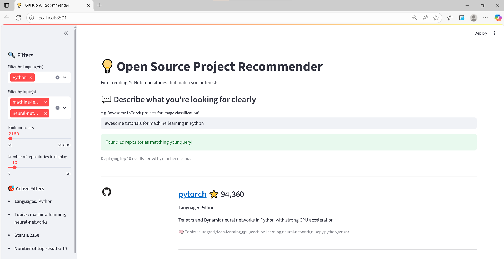

# Open Source Project Recommender
Find trending GitHub repositories that match your interests, skills, or learning goals — all within a clean, fast, and local Streamlit application.

Just describe what you’re looking for and explore curated open-source projects in seconds.

---

## Overview
The Open Source Project Recommender is designed to empower developers and learners by surfacing relevant, high-quality GitHub repositories. It leverages modern search techniques to move beyond keyword matching, offering truly relevant recommendations based on the semantic meaning of your query.

---

## Key features:
- Smart Recommendations: Utilizes text embeddings and similarity search to understand the context of your query.
- Natural Language Search: Easily find projects using descriptive queries (e.g., “awesome PyTorch tutorials for beginners”).
- Comprehensive Filtering: Narrow results by programming language, topic, or GitHub star count.
- Fast, Local Inference: Built on ChromaDB for efficient vector storage and rapid retrieval, ensuring speed without relying on external cloud APIs.
- Interactive UI: A highly intuitive and responsive interface powered by Streamlit.

---

## Tech Stack
| Component           | Technology            |
| ------------------- | --------------------- |
| **Web App**         | Streamlit             |
| **Embedding Model** | Sentence Transformers |
| **Vector Store**    | ChromaDB              |
| **Data Source**     | GitHub REST API       |
| **Language**        | Python 3.11           |

---

## Project Structure
```
├── assets
│   ├── example.png
│   ├── filters.png
│   └── query.png
├── config
│   ├── __init__.py
│   └── config.yaml
├── data
│   └── .gitkeep
├── notebooks
│   └── exploration.ipynb
├── src
│   ├── scripts
│   ├── utils
│   │   ├── config_loader.py
│   │   ├── ensure_existence.py
│   │   ├── helpers.py
│   │   └── logger.py
│   ├── __init__.py
│   ├── chroma_store.py
│   ├── data_processing_pipline.py
│   ├── data_refresher_pipline.py
│   ├── embedder.py
│   ├── github_repos_fetcher.py
│   └── recommender.py
├── .gitignore
├── README.md
├── main.py
├── requirements.txt
└── streamlit_app.py
```
---

## Installation
1. Clone the repository
``` bash
git clone https://github.com/<your-username>/open-source-recommender.git
cd open-source-recommender
``` 
2. Create a virtual environment
``` bash
python -m venv venv
source venv/bin/activate    # On Windows: venv\Scripts\activate
``` 
3. Install dependencies
``` bash
pip install -r requirements.txt
```

---

## Usage
- Run the Streamlit App
``` bash
streamlit run streamlit_app.py
```
- Then open your browser at http://localhost:8501

---

## Example
Here's a look at the application in action:
<p align="center">  </p> <p align="center"><em>The main recommendation view, displaying repository title, description, and metadata.</em></p>

---

## Credits
Created and Maintained by: Israa Elhouch
- **Contact**: issrach235@gmail.com
- **$GitHub**: [github.com/israahch](https://github.com/israahch)
